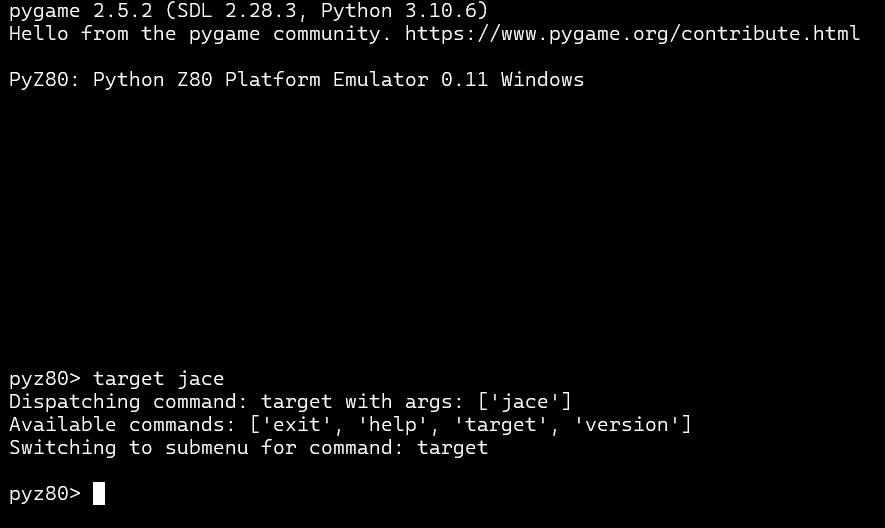

# Py_Z80 for Windows Command Prompt, Python 3.10+

Py_Z80 is a Z80 CPU emulation written in Python. I decided to try to get this emulator working in my Windows environment with a modern version of Python (3.10.6)

Currently the program runs and the commands are able to be used.

Also included is a machine language monitor allowing the user to dump memory, disassemble memory, dump registers and single step machine code.

Two historical machines are emulated:

Jupiter ACE: An obscure British computer from the early 80's distinguished by the choice of Forth for its language.

TEC-1: An even more obscure Australian kit computer from the mid 1980's that was programmed directly in Z80 machine code.

## Current State
The emulation is a work in progress.

The Z80 instruction set is mostly complete. Some instructions remain unimplemented.

The Jupiter ACE emulation is quite functional, but more work needs to be done (tape support and sound support are missing).

The TEC 1 emulation is only slightly functional.

## Usage
jasonh@satan ~/work/code/py_z80 $ make
python ./z80gen.py -o z80bh.py
cat z80th.py > z80.py
cat z80bh.py >> z80.py
jasonh@satan ~/work/code/pyzx80 $ python ./main.py

PyZX80: Python Z80 Platform Emulator 0.1

pyzx80> target jace

emulating "Jupiter ACE"

jace> run

press any key to halt
work the rest out yourself :-)

## Dependencies
Tested with:

* Updated to work with Windows 11 CMD Prompt.
*  Windows Version Updated to Python 3.10+ (3.10.6)

* Linux
* Python 2.4.4
* Pygame 1.7.1

The CLI is likely to have some Linux/Windows issues - I haven't tested running under Windows. (Update, tested in Windows now :) )

## Future Plans
Very few :-)

I had a few primary goals:

* fight off occasional bouts of nostalgia I have about 8 bit machines in a semi-educational way (done).
* satisfy my curiosity about the Jupiter ACE, a machine I did not own back in the day (done).
* see how fast you can emulate a Z80 with a language that is sub-optimal for emulation (answer: not very).

The future TODO list is as long as you want to make it:

* Complete emulation of all Z80 instructions
* Support sound emulation
* Support mouse clicking on the keyboard graphic
* Support tape operations

etc. etc.
Others more obsessive than myself are welcome to contribute.

## Questions/Comments
jth@mibot.com

### Known Issues:
When a keystroke is pressed in the command line, a line is echoed (printed) pushing the command line down, or in other words the user will see things moving upwards. This is a by-product of fixing/updating the program when fixing flashing/improper text input at the command line. I attempted to debug this deeply but I was not able to find a suitable fix for this.

### Modifications and adapation created by alby13, uploaded 8-27-2024
